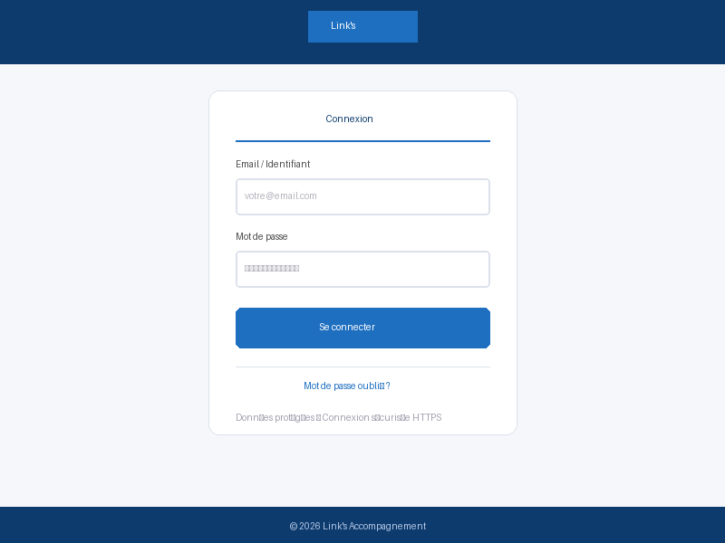
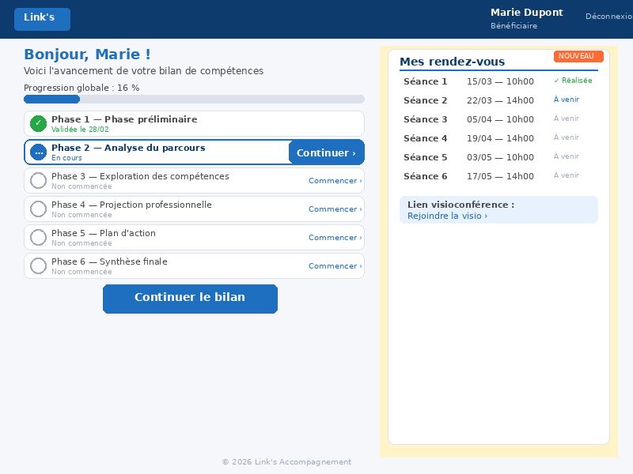
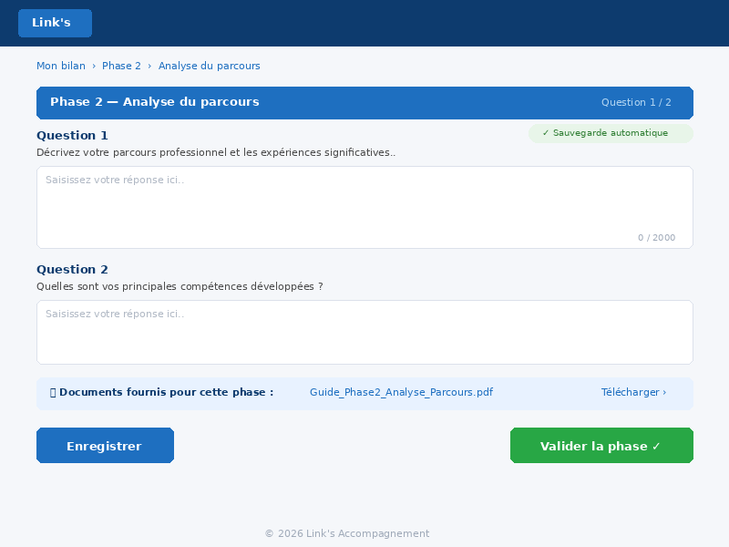
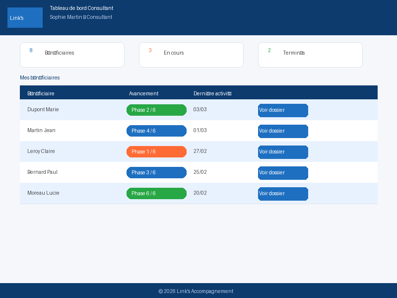
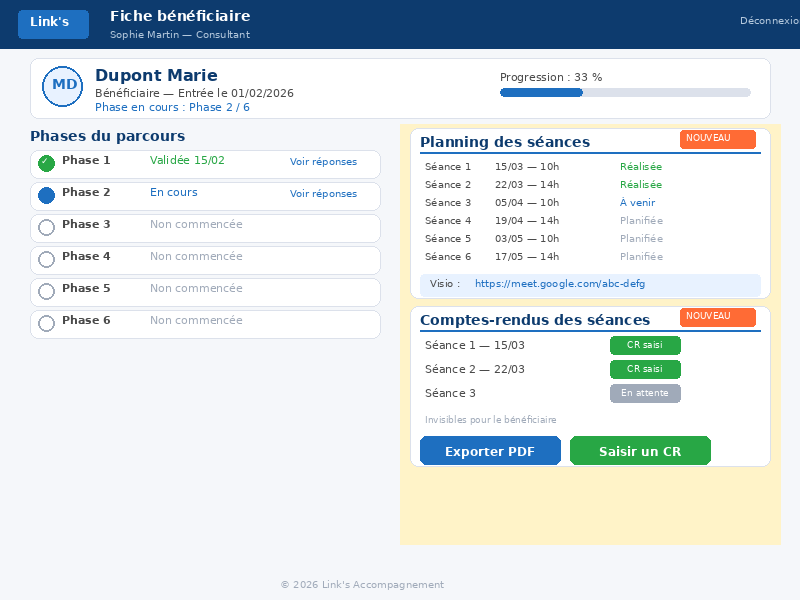
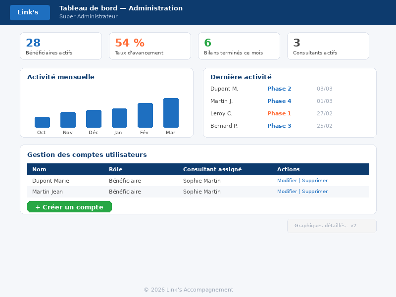
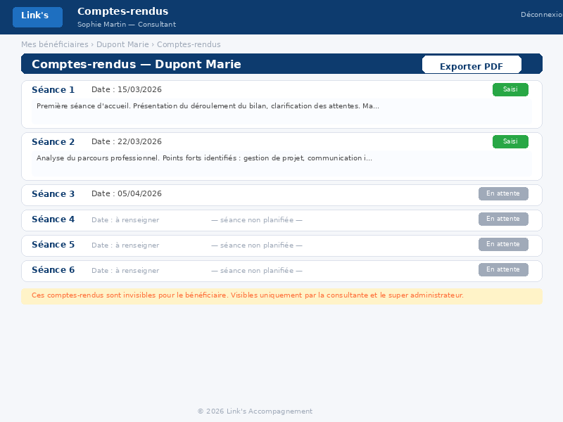

**NOTE DE CADRAGE**

**Plateforme digitale de suivi des bilans de compétences**

*[Version 1.15]*

  -----------------------------------------------------------------------
  **Propriété**          **Valeur**
  ---------------------- ------------------------------------------------
  Client                 Link's Accompagnement

  Auteur                 David Duquenne --- Unanima

  Version                [1.15 --- Document de référence unique]

  Date                   Mars 2026

  Statut                 En cours de validation

  Remplace               [Versions 1.0 à 1.14]
  -----------------------------------------------------------------------

  -----------------------------------------------------------------------
  **Ce document remplace et annule les versions 1.0 à 1.14. Il constitue
  le document de référence unique pour le projet de plateforme de suivi
  des bilans de compétences de Link's Accompagnement.**

  -----------------------------------------------------------------------

+-----------------------------------------------------------------------+
| **DOCUMENT CONFIDENTIEL --- PROPRIÉTÉ UNANIMA**                       |
|                                                                       |
| Ce document est la propriété exclusive de la société Unanima (David   |
| Duquenne). Il est communiqué à Link's Accompagnement à titre          |
| confidentiel, dans le cadre exclusif de l'évaluation d'une            |
| collaboration entre les deux parties.                                 |
|                                                                       |
| Cette note de cadrage constitue une étape préalable aux propositions  |
| commerciales pour les phases de spécifications fonctionnelles puis    |
| d'implémentation. Elle a été rédigée par Unanima et représente un     |
| effort substantiel de synthèse, d'analyse et de recommandation        |
| technique.                                                            |
|                                                                       |
| **Toute reproduction, diffusion ou transmission de ce document à un   |
| tiers --- notamment en vue de solliciter des propositions             |
| commerciales concurrentes --- est strictement interdite sans l'accord |
| préalable écrit d'Unanima.**                                          |
|                                                                       |
| En cas d'accord de Link's Accompagnement pour la réalisation de ce    |
| projet par Unanima, le présent document servira de base à la          |
| rédaction des spécifications fonctionnelles détaillées.               |
+-----------------------------------------------------------------------+

# 1. Synthèse exécutive

Link's Accompagnement souhaite développer une plateforme web dédiée au
suivi des bénéficiaires réalisant un bilan de compétences. L'outil
existant génère des coûts récurrents trop élevés (licences par
utilisateur). L'objectif est de développer une solution à coût fixe,
scalable et simple d'usage.

## 1.1 Contrainte budgétaire

+-----------------------------------------------------------------------+
| *Budget : enveloppe la plus optimisée possible (investissement        |
| initial)*                                                             |
|                                                                       |
| *Estimation PMV v1 : détail dans la proposition commerciale Unanima*  |
|                                                                       |
| *Stratégie : Version 1 (PMV) intégrant les trois profils              |
| utilisateurs, suivie d'une Version 2 optionnelle*                     |
|                                                                       |
| *Prestataire : Unanima (David Duquenne), développeur freelance avec   |
| Claude Code*                                                          |
+-----------------------------------------------------------------------+

## 1.2 Vision produit

  -----------------------------------------------------------------------
  **Critère**          **Version 1 (PMV)**        **Version 2 (cible)**
  -------------------- -------------------------- -----------------------
  Budget               Voir proposition           Voir proposition

  Durée dév.           6 semaines                 4--5 semaines
                                                  supplémentaires

  Estimation           Voir proposition           Voir proposition
                       commerciale                commerciale

  Bénéficiaires par an 25 à 50 / an               Identique

  Interface Super      Tableau de bord complet    Fonctionnalités
  Admin                                           avancées

  Upload fichiers      Hors périmètre (confirmé)  Hors périmètre
  bénéficiaire

  Notifications e-mail Supprimées (économie)      [À arbitrer]
  -----------------------------------------------------------------------

# 2. Contexte et objectifs

## 2.1 Situation actuelle

Link's Accompagnement accompagne des bénéficiaires dans leur bilan de
compétences. Un outil numérique existe mais génère des coûts récurrents
excessifs liés aux licences par utilisateur. La structure souhaite
reprendre la maîtrise de son outil numérique avec une solution
propriétaire à coût fixe.

## 2.2 Objectifs du projet

-   Éliminer les coûts variables par utilisateur (licences SaaS)

-   Accueillir 25 à 50 bénéficiaires par an sans coût supplémentaire

-   Fournir une expérience simple et guidée aux bénéficiaires

-   Permettre aux consultants de suivre l'avancement de leur
    portefeuille

-   Offrir au Super Administrateur un tableau de bord de pilotage
    complet dès la v1

-   Garantir la conformité RGPD et la sécurité des données personnelles

-   Investissement principalement initial (développement), non récurrent
    par utilisateur

## 2.3 Périmètre

  -----------------------------------------------------------------------
  **Dans le périmètre**               **Hors périmètre (à ce stade)**
  ----------------------------------- -----------------------------------
  Authentification 3 profils          Application mobile native
  (bénéficiaire, consultant, super
  admin)

  Parcours 6 phases (accès libre,     Intégration avec des outils tiers
  sans verrouillage)                  (SIRH, CRM)

  Saisie et sauvegarde des réponses   Module de visioconférence intégré

  [Comptes-rendus consultantes (6     [Signature électronique EduSign (v2
  fiches par bénéficiaire + export    --- scénario A confirmé)]
  PDF)]

  [Planification des 6 rendez-vous +
  lien visio]

  Tableau de bord consultant          Facturation en ligne

  Tableau de bord Super               Multi-tenants (plusieurs
  Administrateur (v1)                 organismes)

  Déploiement sur Vercel (HTTPS)
  -----------------------------------------------------------------------

# 3. Typologie des utilisateurs

La plateforme comporte 3 profils utilisateurs avec des rôles distincts,
tous accessibles dès la version 1.

  ------------------------------------------------------------------------------
  **Profil**       **Rôle**                       **Nombre         **Version**
                                                  estimé**
  ---------------- ------------------------------ ---------------- -------------
  Bénéficiaire     Réalise son bilan de           25 à 50 par an   v1
                   compétences via la plateforme  (non simultanés)

  Consultant       Suit et accompagne ses         3 à 5            v1
                   bénéficiaires                  consultants

  Super            Pilote l'activité globale et   1                v1
  Administrateur   gère les comptes
  ------------------------------------------------------------------------------

# 4. Périmètre fonctionnel

## 4.1 Fonctionnalités Bénéficiaire

  -----------------------------------------------------------------------------------------------
  **ID**              **Fonctionnalité**                          **Priorité**      **Version**
  ------------------- ------------------------------------------- ----------------- -------------
  F-BEN-01            Authentification (login / MDP)              **OBLIGATOIRE**   **v1**

  F-BEN-02            Réinitialisation mot de passe par e-mail    **OBLIGATOIRE**   **v1**

  F-BEN-03            Dashboard avec 6 phases et statuts          **OBLIGATOIRE**   **v1**

  F-BEN-04a           Saisie réponses texte longues (10           **OBLIGATOIRE**   **v1**
                      questions)

  F-BEN-04b           Upload pièces jointes (HORS PÉRIMÈTRE ---   HORS PÉRIMÈTRE    ---
                      confirmé par Link's)

  F-BEN-05            Téléchargement documents fournis par phase  **OBLIGATOIRE**   **v1**

  F-BEN-06            Sauvegarde / modification des réponses      **OBLIGATOIRE**   **v1**

  F-BEN-07            Validation de phase                         **OBLIGATOIRE**   **v1**

  F-BEN-08            Autosave (sauvegarde automatique)           **OBLIGATOIRE**   **v1**

  [F-BEN-09]   [Visualisation des dates des 6 séances dans **OBLIGATOIRE**   **v1**
                      l'espace bénéficiaire]

  [F-BEN-10]   [Accès au lien de visioconférence (si       **OBLIGATOIRE**   **v1**
                      renseigné par la consultante)]
  -----------------------------------------------------------------------------------------------

## 4.2 Fonctionnalités Consultant

  --------------------------------------------------------------------------------------------------
  **ID**              **Fonctionnalité**                          **Priorité**         **Version**
  ------------------- ------------------------------------------- -------------------- -------------
  F-CON-01            Authentification et espace dédié            **OBLIGATOIRE**      **v1**

  F-CON-02            Dashboard : liste des bénéficiaires et      **OBLIGATOIRE**      **v1**
                      avancement

  F-CON-03            Indicateur visuel par phase (pastille,      **OBLIGATOIRE**      **v1**
                      barre)

  F-CON-04            Accès au dossier bénéficiaire (lecture)     **OBLIGATOIRE**      **v1**

  F-CON-05            Consultation des réponses saisies           **OBLIGATOIRE**      **v1**

  F-CON-06            Consultation des pièces jointes             SOUHAITABLE          **v2**

  F-CON-07            Tri et filtrage de la liste bénéficiaires   SOUHAITABLE          **v2**

  [F-CON-09]   [Comptes-rendus des séances (date + CR par  **OBLIGATOIRE**      **v1**
                      séance, invisibles bénéficiaire, visibles
                      consultante + super admin)]

  [F-CON-10]   [Export PDF de l'ensemble des               **OBLIGATOIRE**      **v1**
                      comptes-rendus d'un bénéficiaire]

  [F-CON-11]   [Planification des 6 rendez-vous (saisie    **OBLIGATOIRE**      **v1**
                      dates et créneaux horaires)]

  [F-CON-12]   [Saisie du lien de visioconférence (champ   **OBLIGATOIRE**      **v1**
                      lien visio par bénéficiaire)]

  [F-CON-13]   [Notification e-mail des séances au         **[À                 **v1**
                      bénéficiaire (deux hypothèses à arbitrer    ARBITRER]**
                      --- voir section 5.3)]

  [F-CON-14]   [Signature électronique des séances à       **[CONFIRMÉ          **v2**
                      distance (intégration API EduSign ---       v2]**
                      scénario A, cf. étude de
                      faisabilité)]

  F-CON-08            Notification e-mail à validation de phase   HORS PÉRIMÈTRE       ---
                      (SUPPRIMÉE --- économie budget)
  --------------------------------------------------------------------------------------------------

## 4.3 Fonctionnalités Super Administrateur

  --------------------------------------------------------------------------------------
  **ID**     **Fonctionnalité**                          **Priorité**      **Version**
  ---------- ------------------------------------------- ----------------- -------------
  F-ADM-01   Dashboard KPIs globaux (bénéficiaires, taux **OBLIGATOIRE**   **v1**
             d'avancement, bilans terminés)

  F-ADM-02   Création / modification / suppression de    **OBLIGATOIRE**   **v1**
             comptes (identifiants copiés-collés
             manuellement puis envoyés par e-mail au
             bénéficiaire)

  F-ADM-03   Attribution bénéficiaire--consultant        **OBLIGATOIRE**   **v1**

  F-ADM-04   Gestion des documents mis à disposition par **OBLIGATOIRE**   **v1**
             phase

  F-ADM-05   Supervision de l'activité globale (liste    **OBLIGATOIRE**   **v1**
             complète des bénéficiaires)

  F-ADM-06   Graphiques d'activité mensuelle             SOUHAITABLE       **v2**

  F-ADM-07   Gestion des notifications automatiques      OPTIONNEL         **v2**
  --------------------------------------------------------------------------------------

# 5. Règles métier

## 5.1 Accès aux phases

+-----------------------------------------------------------------------+
| *Toutes les phases sont accessibles dès la création du compte         |
| bénéficiaire. Il n'y a pas de verrouillage progressif.*               |
|                                                                       |
| *Le bénéficiaire peut réaliser les phases dans l'ordre qu'il          |
| souhaite.*                                                            |
|                                                                       |
| *Un bénéficiaire peut modifier ses réponses à tout moment, y compris  |
| après validation d'une phase (CONFIRMÉ par Link's).*                  |
|                                                                       |
| *Le parcours comporte 6 phases successives avec questions ouvertes    |
| par phase (nombre variable selon les phases, cf. exemple Séance 2).*  |
+-----------------------------------------------------------------------+

## 5.2 Phases du parcours

  ---------------------------------------------------------------------------
  **Phase**   **Titre indicatif**           **Questions      **Documents**
                                            estimées**
  ----------- ----------------------------- ---------------- ----------------
  Phase 1     Phase préliminaire / Accueil  À définir        À fournir par
                                                             Link's

  Phase 2     Analyse du parcours           À définir        À fournir par
              professionnel                                  Link's

  Phase 3     Exploration des compétences   À définir        À fournir par
                                                             Link's

  Phase 4     Projection professionnelle    À définir        À fournir par
                                                             Link's

  Phase 5     Plan d'action                 À définir        À fournir par
                                                             Link's

  Phase 6     Synthèse finale               À définir        Synthèse générée
  ---------------------------------------------------------------------------

  -----------------------------------------------------------------------
  *QUESTION OUVERTE Q-01 : Le contenu exact des 6 phases (titres
  définitifs, libellés des questions) doit être fourni par Link's
  Accompagnement avant le démarrage du Sprint 1. C'est un élément
  BLOQUANT.*

  -----------------------------------------------------------------------

## [5.3 Rendez-vous et séances d'accompagnement]

[Le parcours de bilan de compétences comporte 6 séances d'accompagnement
avec la consultante, correspondant aux 6 phases du parcours. Chaque
séance fait l'objet d'un rendez-vous planifié.]

+-----------------------------------------------------------------------+
| *[La consultante planifie les 6 rendez-vous (dates et créneaux) dès   |
| la création du compte bénéficiaire. Les dates sont modifiables en     |
| cours de parcours sans déclenchement de notification. Les dates sont  |
| visibles dans l'espace du bénéficiaire.]*                      |
|                                                                       |
| *[Après chaque séance, la consultante saisit un compte-rendu (date +  |
| texte libre). Ces comptes-rendus sont invisibles au bénéficiaire,     |
| visibles uniquement par la consultante et le super administrateur.    |
| Les 6 fiches sont affichées sur une même page et exportables en       |
| PDF.]*                                                         |
|                                                                       |
| *[Un lien de visioconférence peut être renseigné par la consultante   |
| et sera visible par le bénéficiaire dans son espace.]*         |
|                                                                       |
| **[Notification e-mail des séances : deux hypothèses à arbitrer (H1 : |
| e-mail complet au bénéficiaire ; H2 : notification simple à Séverine  |
| qui relaie). En mode dégradé, les dates sont a minima visibles dans   |
| l'espace bénéficiaire.]**                                      |
|                                                                       |
| **[Signature électronique (EduSign) : intégration confirmée pour la   |
| v2 (scénario A --- intégration légère). L'API EduSign est gratuite    |
| (incluse dans l'abonnement), bien documentée (REST/JSON, Bearer       |
| token, SDK npm disponible). Le flux retenu : la plateforme déclenche  |
| l'envoi du document via l'API, EduSign gère la signature (e-mail OTP  |
| au bénéficiaire), puis notifie la plateforme par webhook. Charge      |
| estimée : 2 à 3 jours. Pré-requis BLOQUANT : vérifier que le plan     |
| solution de signature retenue inclut l'accès API et fournir la clé    |
| API --- solution à arbitrer entre EduSign et alternative moins        |
| coûteuse.]**                                                   |
+-----------------------------------------------------------------------+

# 6. Exigences techniques

## 6.1 Contrainte budgétaire --- PRIORITÉ ABSOLUE

  -----------------------------------------------------------------------
  **À éviter**                        **À privilégier**
  ----------------------------------- -----------------------------------
  Licences par utilisateur (SaaS)     Coût fixe maîtrisé (Vercel)

  Coûts variables liés au volume      Architecture scalable 50+
                                      bénéficiaires

  Outils no-code coûteux              Stack open source maintenable
  -----------------------------------------------------------------------

## 6.2 Stack technique recommandée

Le prestataire est libre sur la stack technique sous réserve de
respecter les contraintes suivantes. Suggestion de stack compatible avec
le profil Unanima + Claude Code :

  -----------------------------------------------------------------------------
  **Couche**         **Technologie suggérée**        **Justification**
  ------------------ ------------------------------- --------------------------
  Backend            Node.js/Express ou              Maîtrise large, Claude
                     Python/FastAPI                  Code très efficace

  Base de données    Supabase (PostgreSQL managé)    BDD hébergée, backups
                                                     automatiques, dashboard
                                                     intégré, sécurité RLS
                                                     native

  Frontend           React ou Vue.js                 Composants réactifs,
                                                     écosystème riche

  Authentification   JWT + bcrypt                    Standard sécurisé sans
                                                     dépendance externe

  Hébergement        Vercel (principal) + OVH (DNS)  Vercel : déploiement
                                                     continu, HTTPS auto. OVH :
                                                     hébergement existant
                                                     Link's, coûts mutualisés

  E-mail             Resend                          API e-mail simple, fiable,
                                                     gratuit jusqu'à
                                                     3 000 e-mails/mois

  HTTPS              Inclus Vercel (Let's Encrypt    Certificat SSL géré
                     auto)                           automatiquement, sans
                                                     configuration manuelle
  -----------------------------------------------------------------------------

**Note --- Architecture évolutive (PMV minimal) :** Le PMV v1 est conçu
pour couvrir l'usage actuel de Link's Accompagnement dans l'enveloppe
budgétaire fixée. L'architecture de la base de données intègre d'emblée
les structures nécessaires aux évolutions v2 (champ modele_id sur les
questions, champ modele_parcours sur les comptes consultantes), de sorte
que les lots v2 s'ajoutent sans refonte. Les évolutions anticipées sont
documentées dans le fichier CLAUDE.md livré en fin de projet.

## 6.3 Sécurité et RGPD

-   Authentification sécurisée : JWT tokens, sessions limitées, HTTPS
    obligatoire

-   Mots de passe hachés : bcrypt (facteur de coût ≥ 12)

-   Accès rôle (RBAC) : isolement strict bénéficiaire / consultant /
    super admin

-   Données personnelles minimales : collecte strictement nécessaire au
    bilan

-   Droit à l'effacement : procédure de suppression de compte documentée

-   Sauvegarde régulière : backups automatiques fournis par Supabase
    (quotidiens, rétention 7 jours sur le plan gratuit)

-   Politique de confidentialité et mentions RGPD à intégrer dans
    l'interface

# 7. Approche Claude Code

## 7.1 Présentation

Claude Code est l'outil de codage agentique d'Anthropic. Il lit, écrit,
refactorise et teste du code de façon autonome en dialogue avec le
développeur. Son utilisation est une condition de faisabilité du projet
dans l'enveloppe budgétaire définie.

## 7.2 Impact sur ce projet

+-----------------------------------------------------------------------+
| *L'utilisation de Claude Code permet de livrer les trois espaces      |
| utilisateurs dans une enveloppe budgétaire optimisée.*                |
|                                                                       |
| *L'abonnement Claude Code est pris en charge par Unanima.*            |
+-----------------------------------------------------------------------+

## 7.3 Livrable contractuel : CLAUDE.md

Le fichier CLAUDE.md est le fichier de configuration projet lu par
Claude Code à chaque session. Il documente l'architecture, les
conventions de code et les règles métier. Sa livraison est OBLIGATOIRE à
la fin du projet et garantit la maintenabilité.

# 8. Cadre budgétaire et arbitrages

## 8.1 Définition du Périmètre Minimum Viable (PMV)

  ------------------------------------------------------------------------
  **Module**                                              **Inclus v1**
  --------------------------------------------- --------- ----------------
  Authentification (3 rôles, reset MDP)         ---       **Oui**

  Dashboard bénéficiaire + 6 phases             ---       **Oui**
  séquentielles

  Saisie / sauvegarde / validation des réponses ---       **Oui**

  Téléchargement documents par phase            ---       **Oui**

  Dashboard consultant + accès dossiers         ---       **Oui**

  Dashboard Super Administrateur + gestion      ---       **Oui**
  comptes et attributions

  Déploiement + HTTPS + conformité RGPD de base ---       **Oui**

  Tests + recette + documentation CLAUDE.md     ---       **Oui**

  Upload fichiers bénéficiaire                  ---       **Hors
                                                          périmètre**

  Notifications e-mail automatiques             ---       **Hors
                                                          périmètre**

  [Signature électronique EduSign (Lot          ---       **[v2 (Lot ES,
  ES)]                                             2-3 j)]**

  Autosave (sauvegarde automatique)             ---       **Oui (inclus
                                                          v1)**
  ------------------------------------------------------------------------

+-----------------------------------------------------------------------+
| **Total v1 : détail dans la proposition commerciale Unanima**         |
|                                                                       |
| **Coûts récurrents : dépendant des plans Vercel et Supabase choisis   |
| (possibilité de 0 EUR/mois sur plans gratuits)**                      |
|                                                                       |
| **L'abonnement Claude Code est pris en charge par Unanima, hors       |
| budget projet**                                                       |
+-----------------------------------------------------------------------+

## 8.2 Fonctionnalités exclues et substituts opérationnels

  --------------------------------------------------------------------------
  **Fonctionnalité   **Substitut v1**          **Statut**   **V2**
  exclue**
  ------------------ ------------------------- ------------ ----------------
  Upload fichiers    Hors périmètre (les       ---          Sur devis
  bénéficiaire       bénéficiaires n'envoient
                     pas de fichiers)

  Notifications      Hors périmètre (supprimé  ---          Sur devis
  e-mail auto        pour économie budgétaire)

  Autosave           Inclus en v1 (demande     ---          Sur devis
  (sauvegarde        client)
  automatique)

  [Signature         [Lien direct vers         ---          [Lot ES (2-3
  électronique       l'interface EduSign                    j)]
  EduSign]    existante (aucun
                     développement v1)]
  --------------------------------------------------------------------------

## 8.3 Conditions non négociables

-   Le contenu des phases (titres, questions) est livré avant le
    démarrage du Sprint 1 --- EN COURS

-   Le périmètre v1 est gelé à la signature --- aucun ajout en cours de
    sprint

-   L'utilisation de Claude Code est intégrée dans la prestation Unanima

-   La recette est réalisée en période consolidée (pas de retours
    fragmentés)

## 8.4 Coûts opérationnels récurrents

  ------------------------------------------------------------------------
  **Poste**         **Coût mensuel   **Fournisseur**
                    estimé**
  ----------------- ---------------- -------------------------------------
  Hébergement       0--20 EUR/mois   Vercel (gratuit sur le plan Hobby,
  frontend +                         \~20 EUR/mois sur Pro)
  backend

  Base de données   0--25 EUR/mois   Supabase (gratuit jusqu'à 500 Mo,
  (Supabase)                         \~25 EUR/mois sur Pro)

  Nom de domaine    \~1 EUR/mois     OVH

  HTTPS             Inclus Vercel    Géré automatiquement (Let's Encrypt)

  E-mail            0 EUR/mois       Resend (3 000 e-mails/mois gratuits)
  transactionnel
  (reset MDP)

  ------------------------------------------------------------------------

# 9. Découpage en lots

## 9.1 Version 1 --- PMV (6 semaines)

  --------------------------------------------------------------------------
  **Sprint**   **Contenu**                **Durée**      **Livrable**
  ------------ -------------------------- -------------- -------------------
  Sprint 1     Espace bénéficiaire        3 semaines     Espace bénéficiaire
  (sem. 1--3)  complet : Auth +           (7,5 j dev)    fonctionnel
               dashboard + 6 phases,
               saisie / sauvegarde /
               validation, téléchargement
               documents

  Sprint 2     Espaces consultant et      3 semaines     Plateforme complète
  (sem. 4--6)  Super Admin : dashboard    (7,5 j dev)    déployée
               consultant + dossiers,
               dashboard admin + gestion
               comptes et attributions,
               déploiement Vercel +
               HTTPS, conformité RGPD de
               base + tests + CLAUDE.md
  --------------------------------------------------------------------------

## 9.2 Version 2 --- Fonctionnalités avancées (4--5 semaines)

  ---------------------------------------------------------------------------
  **Lot**      **Contenu**                                     **Durée
                                                               estimée**
  ------------ ----------------------------------------------- --------------
  Lot A        Hors périmètre --- supprimé à la demande du     2 j
               client

  Lot B        Autosave inclus en v1 --- Notifications         3 j
               supprimées définitivement

  Lot C        Graphiques d'activité + gestion notifications   3,5 j
               Super Admin

  Lot D        RGPD complet + refactorisation + tests avancés  4,5 j

  Lot E        Tri / filtrage liste bénéficiaires (consultant) 1 j

  F            [Modèles de parcours par consultante ---        3,0 j
               configurations fournies en amont par Julien
               (CONFIRMÉ). Intégration en dur à la livraison.
               Charge réduite par rapport à l'estimation
               initiale. Aucune interface d'administration
               dynamique requise (parcours stables en année
               1)]

  G            Interface graphique de gestion du contenu des   2,5 j
               phases (modification\\/ajout de questions
               depuis l'espace Super Admin, sans accès
               Supabase)

  IA           Reformulation IA des réponses bénéficiaire      3,0 j
               (bouton IA par question --- architecture
               compatible dès la v1)

  [Lot         [Signature électronique --- intégration API     [2 à 3
  ES]   légère (scénario A) : envoi documents, webhook  j]
               statut, archivage. Solution à arbitrer (EduSign
               ou alternative moins chère). Pré-requis :
               arbitrage solution + clé API]
  ---------------------------------------------------------------------------

# 10. Périmètre et modules de développement

## 10.1 Version 1 --- Périmètre de développement

Le chiffrage détaillé (coûts de développement, ventilation par module,
TJM) sera présenté dans la proposition commerciale Unanima.
L'utilisation de Claude Code permet une optimisation significative des
coûts.

  ----------------------------------------------------------------------------
  **Module**                    **Charge\                      **Coût\
                                (estimation Unanima)**         Voir
                                                               proposition**
  ----------------------------- ------------------------------ ---------------
  Authentification +            1,5 j                          ---
  réinitialisation MDP

  Dashboard bénéficiaire + 6    3 j                            ---
  phases séquentielles

  Saisie / sauvegarde /         2 j                            ---
  validation + autosave

  Téléchargement documents par  1 j                            ---
  phase

  Dashboard consultant + accès  2,5 j                          ---
  dossiers

  Dashboard Super Admin +       3,5 j                          ---
  gestion comptes et
  attributions

  Déploiement + HTTPS +         2 j                            ---
  conformité RGPD de base

  Tests + recette + CLAUDE.md   1 j                            ---

  [Comptes-rendus consultantes  [À chiffrer]            ---
  (6 fiches + export
  PDF)]

  [Planification des 6          [À chiffrer]            ---
  rendez-vous + visibilité
  bénéficiaire]

  [Lien visioconférence (saisie [À chiffrer]            ---
  consultante + affichage
  bénéficiaire)]

  [Notification e-mail séances  [À chiffrer]            ---
  (H1 ou H2 --- selon
  arbitrage)]

  ----------------------------------------------------------------------------

  -------------------------------------------------------------------------
  **Poste coût                 **Montant   **Détail**
  complémentaire**             HT**
  ---------------------------- ----------- --------------------------------
  Vercel (plan Pro × 1 mois    \~20 €      Gratuit sur Hobby ; Pro
  déploiement)                             recommandé pour la production

  Supabase (plan Pro × 1 mois) \~25 €      Plan gratuit suffisant en phase
                                           de lancement

  Resend                       0 €         3 000 e-mails/mois gratuits,
                                           amplement suffisant

  Nom de domaine (1 an)        \~12 €      OVH ou Gandi

  -------------------------------------------------------------------------

+-----------------------------------------------------------------------+
| **Le détail du chiffrage est présenté dans la proposition commerciale |
| Unanima**                                                             |
|                                                                       |
| **Hypothèse : TJM et conditions dans la proposition commerciale       |
| Unanima**                                                             |
|                                                                       |
| **Coûts récurrents après livraison : voir section 8.4**               |
+-----------------------------------------------------------------------+

## 10.2 Version 2 --- Périmètre additionnel

  -----------------------------------------------------------------------
  **Lot**                                              **Chiffrage**
  ---------------------------------------------------- ------------------
  Lot A --- Hors périmètre (supprimé)                  Sur devis

  Lot B --- (Autosave inclus en v1, notifications      Sur devis
  supprimées)

  Lot C --- Graphiques + gestion notifications Admin   Sur devis

  Lot D --- RGPD complet + refactorisation             Sur devis

  Lot E --- Tri / filtrage                             Sur devis

  Lot F --- Modèles de parcours par consultante        Sur devis
  (questions spécifiques)

  Lot G --- Interface graphique de gestion du contenu  Sur devis
  des phases (Super Admin)

  Lot IA --- Reformulation IA des réponses             Sur devis
  bénéficiaire

  [Lot ES --- Signature électronique EduSign           [Sur devis (2 à 3
  (intégration API légère, scénario A)]         j estimés)]
  -----------------------------------------------------------------------

# 11. Risques et mesures d'atténuation

  ------------------------------------------------------------------------------------------
  **ID**          **Risque**               **Proba**   **Impact**   **Atténuation**
  --------------- ------------------------ ----------- ------------ ------------------------
  R-01            Contenu phases non       **Élevé**   **Élevé**    Contrat conditionné à
                  fourni à temps                                    réception avant kick-off

  R-02            Dépassement budget sur   **Moyen**   **Élevé**    Périmètre gelé
                  périmètre PMV                                     contractuellement,
                                                                    change management strict

  R-03            Dépassement de charge    **Moyen**   **Moyen**    Prototypage rapide en
                  sur le périmètre Super                            début de Sprint 2 ;
                  Admin                                             périmètre gelé
                                                                    contractuellement

  R-04            Données personnelles     Faible      **Élevé**    JWT, HTTPS, accès rôle,
                  exposées (RGPD)                                   backup chiffré

  R-05            Complexité Super Admin   **Moyen**   **Moyen**    Claude Code +
                  sous-estimée                                      prototypage rapide en
                                                                    début de Sprint 2

  R-06            Retard recette (retours  **Moyen**   **Moyen**    Recette en 5 jours
                  fragmentés)                                       consolidés, référent
                                                                    désigné

  R-07            Perte du prestataire     **Moyen**   **Moyen**    CLAUDE.md obligatoire,
                  (Unanima) après v1                                documentation API
                                                                    complète

  R-08            Version 2 jamais         **Moyen**   Faible       Substituts v1 documentés
                  financée                                          pour exploitation
                                                                    durable

  [R-09]   [Plan EduSign sans accès **Moyen**   **Moyen**    [Vérification du plan
                  API ou clé API non                                EduSign BLOQUANTE avant
                  fournie]                                   développement (cf. étude
                                                                    de faisabilité).
                                                                    Fallback : signature
                                                                    manuelle via interface
                                                                    EduSign]
  ------------------------------------------------------------------------------------------

# 12. Gouvernance

## 12.1 Parties prenantes

  ------------------------------------------------------------------------
  **Rôle**         **Responsabilité**                    **Disponibilité
                                                         requise**
  ---------------- ------------------------------------- -----------------
  Sponsor Link's   Validation stratégique, déblocage     2 h/semaine
                   budgétaire

  Chef de projet   Suivi quotidien, validation           Temps partiel
  Link's           fonctionnelle, recette                (\~4 h/semaine)

  Super            Tests d'acceptation interface admin,  3 h en semaine 6
  Administrateur   formation en fin de projet
  Link's

  Prestataire      Développement, déploiement,           Temps plein (6
  (Unanima)        documentation (Unanima / David        sem. v1)
                   Duquenne)

  Consultant       Validation UX consultant, tests       2 h en semaine 6
  pilote           d'acceptation
  ------------------------------------------------------------------------

## 12.2 Livrables contractuels

  ------------------------------------------------------------------------
  **Livrable**        **Description**                     **Date limite**
  ------------------- ----------------------------------- ----------------
  Application v1      URL de production accessible, HTTPS Fin Sprint 2
  déployée

  Code source         Repository Git avec historique de   Fin Sprint 2
                      commits

  CLAUDE.md           Fichier de configuration Claude     Fin Sprint 2
                      Code, architecture documentée

  Guide Super         Manuel d'utilisation de l'interface Fin Sprint 2
  Administrateur      admin (gestion comptes,
                      attributions)

  Rapport de tests    Scénarios de tests exécutés, taux   Fin recette
                      de couverture
  ------------------------------------------------------------------------

## 12.3 Livrables Link's Accompagnement (pré-requis)

  -----------------------------------------------------------------------
  **Livrable**                                  **Urgence**
  --------------------------------------------- -------------------------
  Contenu des 6 phases : titres définitifs +    **BLOQUANT avant
  libellés des questions                        kick-off**

  Liste des documents à fournir par phase (PDF, **Bloquant Sprint 1**
  guides)

  Nom de domaine retenu                         Sprint 1

  Charte graphique confirmée (logos vectoriels, Sprint 1
  couleurs exactes)

  Choix du plan Supabase (gratuit ou Pro selon  Avant kick-off
  volume attendu)

  [Clé API EduSign + confirmation du plan       **[BLOQUANT Lot ES
  incluant l'accès API]                  (v2)]**
  -----------------------------------------------------------------------

# 13. Critères d'acceptation

La plateforme v1 sera considérée comme acceptée si et seulement si les
critères suivants sont validés :

  --------------------------------------------------------------------------------
  **ID**           **Critère**                        **Test de validation**
  ---------------- ---------------------------------- ----------------------------
  CA-01            Authentification sécurisée (3      Login / logout sur 3
                   rôles)                             comptes, réinitialisation
                                                      MDP fonctionnelle

  CA-02            Accès libre aux phases             Toutes les phases
                                                      accessibles ; le
                                                      bénéficiaire peut naviguer
                                                      librement

  CA-03            Saisie et sauvegarde des réponses  Fermer / rouvrir la
                                                      session : réponses
                                                      conservées

  CA-04            Validation de phase                Validation de phase
                                                      enregistrée ; accès libre
                                                      maintenu

  CA-05            Téléchargement documents par phase Fichier téléchargé depuis au
                                                      moins 2 phases

  CA-06            Dashboard consultant complet       Liste bénéficiaires +
                                                      avancement + accès dossiers
                                                      OK

  CA-07            Dashboard Super Admin fonctionnel  KPIs affichés, création
                                                      compte test OK, attribution
                                                      bénéficiaire OK

  CA-08            Déploiement HTTPS en production    URL de production avec
                                                      certificat SSL valide

  CA-09            conformité RGPD de base            Mentions légales + politique
                                                      de confidentialité
                                                      accessibles

  CA-10            CLAUDE.md livré                    Fichier présent dans le
                                                      repository, documentation
                                                      complète

  CA-11            Performance                        Chargement dashboard \< 3
                                                      secondes sur connexion
                                                      standard

  CA-12            Responsive                         Interface utilisable sur
                                                      desktop (priorité) et
                                                      tablette

  [CA-13]   [Comptes-rendus consultantes :     [Test : saisir 2 CR,
                   saisie, affichage 6 fiches,        vérifier invisibilité côté
                   invisibilité bénéficiaire, export  bénéficiaire, exporter
                   PDF]                        PDF]

  [CA-14]   [Planification séances : 6 dates   [Test : saisir dates côté
                   saisies, visibles dans l'espace    consultante, vérifier
                   bénéficiaire]               affichage côté
                                                      bénéficiaire]

  [CA-15]   [Lien visioconférence accessible   [Test : saisir lien côté
                   par le bénéficiaire]        consultante, vérifier accès
                                                      côté bénéficiaire]

  --------------------------------------------------------------------------------

# 14. Calendrier indicatif

  --------------------------------------------------------------------------
  **Jalon**        **Contenu**                                 **Semaine**
  ---------------- ------------------------------------------- -------------
  J-0 : Kick-off   Signature contrat, réception contenu        S+0
                   phases, briefing technique

  J-1 : Fin Sprint Espace bénéficiaire fonctionnel, démo       S+3
  1                intermédiaire

  J-2 : Fin Sprint Plateforme complète déployée sur Vercel     S+6
  2                (bénéficiaire + consultant + admin),
                   recette client

  J-3 :            Validation critères d'acceptation,          S+6 (+5 j)
  Acceptation      signature recette

  J-4 : Formation  Formation Super Administrateur + transfert  S+6 (+1 j)
                   de compétences

  \[V2\]           Accord financement v2 selon disponibilité   S+7 minimum
  Financement
  --------------------------------------------------------------------------

# 15. Charte graphique

La charte graphique de la plateforme s'appuie sur l'identité visuelle de
Link's Accompagnement, telle qu'observée sur
www.links-accompagnement.com. L'objectif est d'assurer une continuité de
marque entre le site institutionnel et la plateforme applicative.

## 15.1 Palette de couleurs

La palette est construite autour du bleu signature de Link's, couleur
centrale du logo, complétée par des couleurs fonctionnelles adaptées aux
états de l'interface.

  --------------------------------------------------------------------------
  **Rôle**         **Code          **Usage dans l'interface**
                   hexadécimal**
  ---------------- --------------- -----------------------------------------
  Bleu principal   #1E6FC0         Boutons primaires, liens actifs, badges
                                   phases en cours, barres de progression

  Bleu foncé       #0D3B6E         Header de navigation, titres de section,
                                   fond en-tête

  Blanc            #FFFFFF         Fonds de cartes, champs de saisie,
                                   espaces de contenu

  Gris clair       #F5F7FA         Fond général de l'application, alternance
                                   lignes tableaux

  Gris texte       #4A4A4A         Corps de texte, labels de formulaires

  Gris bordure     #DCE1EB         Bordures de cartes, séparateurs, champs
                                   non actifs

  Bleu clair       #E8F2FF         Fond phases en cours, surlignage lignes
                                   actives

  Vert succès      #28A745         Phases validées, messages de
                                   confirmation, bouton Valider

  Orange accent    #FF6B35         Indicateurs d'alerte, statistiques
                                   bénéficiaires en cours

  Gris inactif     #A0AAB9         Phases non commencées, fonctionnalités
                                   non disponibles (v2)
  --------------------------------------------------------------------------

## 15.2 Typographie

Police recommandée : Inter (Google Fonts, licence libre). Alternatives :
Poppins ou Open Sans, compatibles avec l'identité Link's.

  ------------------------------------------------------------------------
  **Usage**         **Police**       **Graisse**   **Taille indicative**
  ----------------- ---------------- ------------- -----------------------
  Titres principaux Inter ou Poppins Bold 700      24--28 px
  (H1)

  Titres de section Inter ou Poppins SemiBold 600  18--20 px
  (H2)

  Corps de texte    Inter            Regular 400   14--16 px

  Labels de         Inter            Medium 500    14 px
  formulaires

  Texte secondaire  Inter            Regular 400   12--13 px --- couleur
  / aide                                           #888888

  Boutons et CTA    Inter            SemiBold 600  14--15 px
  ------------------------------------------------------------------------

## 15.3 Composants UI

  -----------------------------------------------------------------------
  **Composant**        **Spécification**
  -------------------- --------------------------------------------------
  Bouton primaire      Fond #1E6FC0, texte blanc, coins arrondis 6 px,
                       hauteur 40--44 px

  Bouton secondaire    Fond transparent, bordure #1E6FC0, texte #1E6FC0

  Bouton succès        Fond #28A745 --- uniquement pour validations
  (valider phase)      finales

  Champ de saisie      Fond blanc, bordure #DCE1EB 1 px, focus → bordure
                       #1E6FC0 2 px

  Zone de texte long   Hauteur min. 120 px, redimensionnable, compteur de
                       caractères

  Carte / panel        Fond blanc, bordure #DCE1EB 1 px, coins 8--12 px,
                       ombre légère

  Badge phase validée  Cercle vert #28A745 + icône check blanc

  Badge phase en cours Cercle bleu #1E6FC0 + indicateur animé

  Badge phase non      Cercle gris #A0AAB9 + cercle ouvert (phase
  commencée            accessible)

  Header de navigation Fond #0D3B6E, logo Link's à gauche, menu
                       utilisateur à droite, hauteur 64 px

  Responsive           Breakpoints : mobile 375 px, tablette 768 px,
                       desktop 1 280 px
  -----------------------------------------------------------------------

## 15.4 Accessibilité

-   Contraste texte / fond : ratio WCAG AA minimum (4,5 :1 pour le corps
    de texte)

-   Le bleu #1E6FC0 sur fond blanc atteint un ratio de contraste de
    \~4,6 :1 --- conforme WCAG AA

-   Focus visible sur tous les éléments interactifs (outline #1E6FC0)

-   Attributs ARIA sur les éléments de progression (aria-label,
    aria-valuenow)

-   Textes alternatifs sur toutes les images et icônes fonctionnelles

# 16. Maquettes des écrans (wireframes)

Les maquettes ci-dessous reprennent les wireframes du cahier des charges
client et les traduisent dans la charte graphique de Link's
Accompagnement. Elles constituent le référentiel visuel de la v1.

  -------------------------------------------------------------------------------------------
  **Écran**    **Titre**                              **Profil**            **Version**
  ------------ -------------------------------------- --------------------- -----------------
  1            Page de connexion                      Tous profils          v1

  2            Dashboard bénéficiaire                 Bénéficiaire          v1

  3            Page de saisie d'une phase             Bénéficiaire          v1

  4            Dashboard consultant                   Consultant            v1

  5            Fiche bénéficiaire (vue consultant)    Consultant            v1

  6            Dashboard super administrateur         Super Admin           v1

  [7]   [Comptes-rendus des séances (vue       [Consultant]   **[v1]**
               consultante)]
  -------------------------------------------------------------------------------------------

## Écran 1 --- Page de connexion

Objectif : Authentification sécurisée des utilisateurs (bénéficiaires,
consultants, administrateur).

  -----------------------------------------------------------------------
  **Élément**      **Description**
  ---------------- ------------------------------------------------------
  Logo Link's      Centré en haut, version bleue sur fond #0D3B6E

  Formulaire       Email / identifiant + mot de passe, carte blanche
                   centrée avec ombre

  Bouton connexion Bleu #1E6FC0, pleine largeur du formulaire

  Lien réinit. MDP En dessous du bouton, texte #1E6FC0 cliquable

  Sécurité         Connexion HTTPS --- mention discrète en bas de carte
  -----------------------------------------------------------------------

## Écran 2 --- Dashboard bénéficiaire

Objectif : Visualisation de la progression dans les 6 phases et reprise
du parcours.

  ------------------------------------------------------------------------
  **Élément**           **Description**
  --------------------- --------------------------------------------------
  Message de bienvenue  Prénom du bénéficiaire --- ton chaleureux et
                        personnalisé

  Barre de progression  Pourcentage calculé sur les phases validées / 6

  Carte Phase validée   Badge vert check, titre, date de validation

  Carte Phase en cours  Bordure bleue, badge bleu animé, bouton Continuer

  Carte Phase non       Grise claire, cercle ouvert, lien Commencer ›
  commencée             (accessible)

  Bouton CTA principal  Continuer le bilan --- bleu, centré en bas

  **[Panneau Mes        [Carte latérale affichant les 6 dates de séances
  rendez-vous           avec statut (réalisée / à venir) + lien de
  (NOUVEAU)]**   visioconférence cliquable]
  ------------------------------------------------------------------------

## Écran 3 --- Page de saisie d'une phase

Objectif : Répondre aux questions de la phase en cours et valider la
phase.

  -----------------------------------------------------------------------
  **Élément**         **Description**
  ------------------- ---------------------------------------------------
  Breadcrumb          Mon bilan \> Phase N \> Titre --- navigation
                      contextuelle

  En-tête de phase    Bandeau bleu avec titre et compteur de questions

  Zone de question    Label + énoncé + textarea avec compteur de
                      caractères

  Section documents   Zone bleue claire avec lien de téléchargement des
                      fichiers fournis

  Bouton Enregistrer  Gris-bleu secondaire --- sauvegarde manuelle
                      complémentaire (autosave actif en permanence)

  Bouton Valider      Vert #28A745 --- marque la phase comme terminée
  phase
  -----------------------------------------------------------------------

## Écran 4 --- Dashboard consultant

Objectif : Vision d'ensemble du portefeuille bénéficiaires et accès
rapide aux dossiers.

  -----------------------------------------------------------------------
  **Élément**          **Description**
  -------------------- --------------------------------------------------
  KPIs en haut         3 cartes : total bénéficiaires, en cours (orange),
                       terminés (vert)

  Tableau              Colonnes : Nom, Phase / avancement (badge coloré),
  bénéficiaires        Dernière activité, Actions

  Badge d'avancement   Coloré selon phase : bleu (en cours), vert
                       (terminé), orange (retard)

  Bouton Voir dossier  Bleu, aligné à droite de chaque ligne bénéficiaire

  Tri / filtrage (v2)  Absent en v1, affiché en grisé avec mention
                       « Disponible en v2 »
  -----------------------------------------------------------------------

## Écran 5 --- Fiche bénéficiaire (vue consultant)

Objectif : Accès aux réponses et à la progression détaillée d'un
bénéficiaire.

  -------------------------------------------------------------------------
  **Élément**           **Description**
  --------------------- ---------------------------------------------------
  En-tête fiche         Avatar initiales, nom, date d'entrée, phase
                        actuelle

  Barre de progression  Identique dashboard bénéficiaire --- vue consultant
                        en lecture seule

  Détail par phase      Mêmes codes visuels que le dashboard (badges
                        colorés)

  Bouton Voir les       Bleu, visible sur les phases complétées ou en cours
  réponses

  Accès pièces jointes  v2 --- grisé avec mention « Disponible en v2 »

  **[Planning des       [Carte affichant les 6 dates/créneaux des séances
  séances               avec statuts (réalisée, à venir, planifiée) + lien
  (NOUVEAU)]**   visioconférence]

  **[Comptes-rendus     [Carte avec statuts de saisie des CR par séance
  (NOUVEAU)]**   (saisi / en attente), mention « invisibles pour le
                        bénéficiaire », boutons Exporter PDF et Saisir un
                        CR]
  -------------------------------------------------------------------------

## Écran 6 --- Dashboard super administrateur

Objectif : Pilotage global de l'activité, gestion des comptes
utilisateurs et attribution des bénéficiaires aux consultants. Cet écran
est inclus dans la version 1.

  -----------------------------------------------------------------------
  **Élément**         **Description**
  ------------------- ---------------------------------------------------
  KPIs globaux        4 cartes : bénéficiaires actifs, taux d'avancement
                      moyen, bilans terminés, consultants actifs

  Liste complète      Tous les bénéficiaires avec phase actuelle,
                      consultant assigné et date dernière activité

  Gestion des comptes Création, modification et suppression de comptes
                      bénéficiaires et consultants

  Attribution         Association bénéficiaire--consultant directement
                      depuis l'interface

  Gestion documents   Dépôt et mise à jour des documents mis à
  (phases)            disposition par phase

  Graphiques          Histogramme mensuel des validations --- disponible
  d'activité (v2)     en version 2
  -----------------------------------------------------------------------

## [Écran 7 --- Comptes-rendus des séances (vue consultante)]

[Objectif : Saisie et consultation des comptes-rendus des 6 séances
d'accompagnement. Les 6 fiches sont affichées les unes sous les autres
sur une même page, avec export PDF. Ces comptes-rendus sont invisibles
pour le bénéficiaire.]

  --------------------------- --------------------------------------------------
  **Élément**                 **Description**

  **[Breadcrumb]**     [Mes bénéficiaires › \[Nom\] › Comptes-rendus ---
                              navigation contextuelle]

  **[6 fiches de              [Empilées verticalement sur une même page. Chaque
  séance]**            fiche contient : label séance, date, texte du
                              compte-rendu, badge statut (saisi / en
                              attente)]

  **[Bouton Exporter          [Exporte l'ensemble des 6 fiches en un seul PDF
  PDF]**               --- accessible depuis l'en-tête de page]

  **[Mention de               [Bandeau rappelant que les comptes-rendus sont
  confidentialité]**   invisibles pour le bénéficiaire (visibles
                              consultante + super admin uniquement)]
  --------------------------- --------------------------------------------------

# 17. Annexes

## Annexe A --- Glossaire

  -----------------------------------------------------------------------
  **Terme**                    **Définition**
  ---------------------------- ------------------------------------------
  Bénéficiaire                 Personne réalisant un bilan de compétences
                               via la plateforme

  Consultant                   Professionnel de Link's accompagnant les
                               bénéficiaires

  Super Admin                  Gestionnaire de la plateforme avec accès
                               complet à l'interface d'administration dès
                               la v1

  PMV                          Périmètre Minimum Viable --- ensemble
                               minimal de fonctionnalités pour un service
                               opérationnel

  v1                           Première version livrée --- inclut les 3
                               profils utilisateurs

  v2                           Version complète --- financement
                               complémentaire à prévoir

  Claude Code                  Outil de codage agentique d'Anthropic ---
                               lit, écrit et teste du code de façon
                               autonome

  CLAUDE.md                    Fichier de configuration projet lu par
                               Claude Code à chaque session --- livrable
                               obligatoire

  Vercel                       Plateforme de déploiement frontend +
                               backend serverless avec HTTPS automatique
                               et CI/CD depuis Git

  Supabase                     Plateforme BaaS open-source fournissant un
                               PostgreSQL managé, des backups
                               automatiques et un dashboard
                               d'administration

  Resend                       Service d'envoi d'e-mails transactionnels
                               via API --- 3 000 e-mails/mois gratuits

  RGPD                         Règlement Général sur la Protection des
                               Données (UE 2016/679)

  RBAC                         Role-Based Access Control --- contrôle
                               d'accès basé sur les rôles utilisateurs

  Unanima                      Société de David Duquenne --- prestataire
                               en charge du développement, du déploiement
                               et de la documentation de la plateforme

  EduSign                      [Service de signature électronique utilisé
                               par Link's Accompagnement --- intégration
                               API confirmée en v2 (scénario A, 2 à 3 j).
                               API REST gratuite, conformité
                               eIDAS]

  [Séance]              [Rendez-vous d'accompagnement entre la
                               consultante et le bénéficiaire --- 6
                               séances par parcours de bilan]
  -----------------------------------------------------------------------

## Annexe B --- Réponses aux questions ouvertes

**Q-01 Quel est le contenu exact des 6 phases (titres, questions) ?**

Un exemple de questionnaire a été fourni pour la phase 2 : 15 questions
réparties dans 3 rubriques.

**Q-02 Quels documents sont mis à disposition par phase ?**

Au maximum un ou 2/3 pdf à télécharger, mais ça peut juste être des
liens vers des fichiers hébergés sur les serveurs Link's.

**Q-03 Quel nom de domaine sera utilisé ?**

Celui de Link's

**Q-04 L'hébergement est-il géré par le prestataire ou Link's ?**

Idéalement le même hébergement OVH que le site actuel de Link's.

En fait, pour des questions de facilité de maintenance, l'hébergement se
fera sur Vercel avec une configuration côté OVH pour rediriger vers
l'instance déployée.

**Q-05 Charte graphique : logos vectoriels disponibles ?**

Oui

**Q-06 Un bénéficiaire peut-il modifier ses réponses après validation de
phase ?**

Oui

**Q-07 Faut-il prévoir une migration des données depuis l'outil
actuel ?**

Non

**Q-08 Quel est le calendrier de financement envisagé pour la v2 ?**

Non défini

**Q-09 Codes couleurs exacts (#hex) à confirmer avant intégration charte
graphique ?**

Disponibles

**Q-10 L'hébergement sur Vercel engendre-t-il des frais supplémentaires
par rapport à OVH ?**

Non. Vercel est l'hébergeur principal de l'application. OVH est utilisé
uniquement pour la redirection DNS du sous-domaine
bilan.links-accompagnement.com --- aucun hébergement OVH dédié n'est
requis. Les coûts récurrents (Vercel, Supabase) sont détaillés dans la
section 8.4 et dans la proposition commerciale.

**Q-11 Est-il possible de modifier ou d'ajouter des questions
directement dans Supabase sans dérégler la plateforme ?**

Oui, selon le type d'opération  :

-   **Modifier le texte d'une question **: aucun risque, aucune perte.
    Les réponses sont liées à l'identifiant technique de la question,
    pas à son texte. La plateforme affiche le nouveau libellé au
    prochain chargement ; les réponses déjà saisies restent intactes.

-   **Ajouter une question **: possible sans impact sur les réponses
    existantes. Les bénéficiaires ayant déjà validé la phase concernée
    verront la nouvelle question avec un champ vide. Bonne pratique :
    effectuer les modifications hors des périodes actives de saisie.

-   **Désactiver une question (jamais supprimer physiquement)** :
    l'architecture prévoit un statut actif/inactif par question. Une
    question désactivée n'est plus affichée aux nouveaux bénéficiaires,
    mais les réponses déjà saisies restent consultables dans les
    dossiers. La suppression physique est à éviter : les réponses
    existantes deviendraient orphelines (invisibles dans l'interface,
    mais non effacées en base).

-   **Bilans terminés **: intouchables dans tous les cas. Aucune
    modification de contenu n'affecte rétroactivement les données déjà
    saisies. L'interface graphique dédiée (Lot G, v2) sécurisera ces
    opérations sans accès direct à Supabase.

**Q-12 Est-il possible que certaines consultantes aient des questions
spécifiques dans leurs phases, différentes des questions standard ?**

Oui, via un système de modèles de parcours (Lot F, prévu en v2). Il
existe un modèle standard (6 phases, questions de base pour toutes les
consultantes) et des modèles personnalisés associés à une consultante
spécifique. À la création d'un compte consultante, le Super Admin
choisit le modèle appliqué : tous les bénéficiaires rattachés à cette
consultante héritent du même modèle. L'architecture de la v1 anticipe
cette évolution (champ modele_id et modele_parcours prévus dès la
conception de la base de données).

**[Q-13 Les dates des 6 séances sont-elles toujours définies dès la
création du compte, ou peuvent-elles être ajoutées/modifiées en cours de
parcours ?]**

[Oui, les dates des 6 séances peuvent être modifiées en cours de
parcours (CONFIRMÉ par Julien). Précision importante : aucune
notification e-mail n'est déclenchée en cas de modification ultérieure
des dates. La notification n'est envoyée qu'à la planification initiale,
au moment de la création du compte bénéficiaire.]

**[Q-14 Lien visioconférence : un seul lien global par bénéficiaire ou
un lien distinct par séance ?]**

[Un seul lien de visioconférence global pour l'ensemble du parcours
(CONFIRMÉ par Julien). La consultante saisit un unique lien (Teams,
Zoom, Meet...) visible par le bénéficiaire dans son espace pour toutes
les séances. Aucun lien distinct par séance n'est requis.]

**[Q-15 Quelle hypothèse de notification e-mail est retenue pour les
séances (H1 : e-mail complet au bénéficiaire ; H2 : notification à
Séverine) ?]**

[Julien confirme qu'il faut étudier les deux hypothèses (H1 et H2).
Décision finale à prendre par Link's Accompagnement avant le démarrage
du Sprint 2 --- le choix impacte le chiffrage. Précision complémentaire
confirmée : en cas de modification ultérieure des dates de séances,
aucune notification supplémentaire n'est attendue.]

**[Q-16 Intégration EduSign : quelles sont les conditions d'accès à
l'API EduSign (documentation, coûts, contrat existant) ?]**

[Étude de faisabilité réalisée (cf. document séparé). Résultat :
intégration techniquement faisable. Julien indique qu'une alternative à
EduSign est envisageable si elle est moins chère et plus simple à
intégrer. Unanima évaluera les options disponibles (EduSign, YouSign,
Universign...) sur les critères : coût, simplicité d'intégration API,
conformité eIDAS. Une recommandation sera formulée avant le démarrage du
Lot ES. Pré-requis BLOQUANT : arbitrage de la solution de signature
électronique à valider entre Unanima et Link's Accompagnement avant
lancement du Lot ES (v2).]

**[Q-17 Lot F (modèles de parcours par consultante) : les configurations
sont-elles fournies en amont pour intégration « en dur », ou faut-il
prévoir une interface d'administration dynamique ?]**

[CONFIRMÉ par Julien : les configurations de phases par consultante
seront fournies en amont du développement. Les modèles seront intégrés
directement en base à la livraison (intégration « en dur »), sans
interface d'administration dynamique --- réduction significative de la
charge du Lot F. Julien confirme également que les parcours n'évolueront
pas en année 1, ce qui rend ce choix optimal pour maîtriser les coûts.
Contrepartie : toute modification ultérieure nécesssitera une
intervention technique d'Unanima.]

## Annexe C --- Références réglementaires et études

**Réglementaires :**

-   Code du Travail, article L6313-4 : cadre légal du bilan de
    compétences

-   Règlement (UE) 2016/679 (RGPD) : protection des données personnelles

-   Référentiel ANSSI sur la sécurité des applications web

**Études sur l'apport de Claude Code :**

-   Anthropic (août 2025) : utilisation de Claude Code dans le
    développement interne

-   Thoughtworks Technology Radar (novembre 2025) : Claude Code en
    statut Trial
